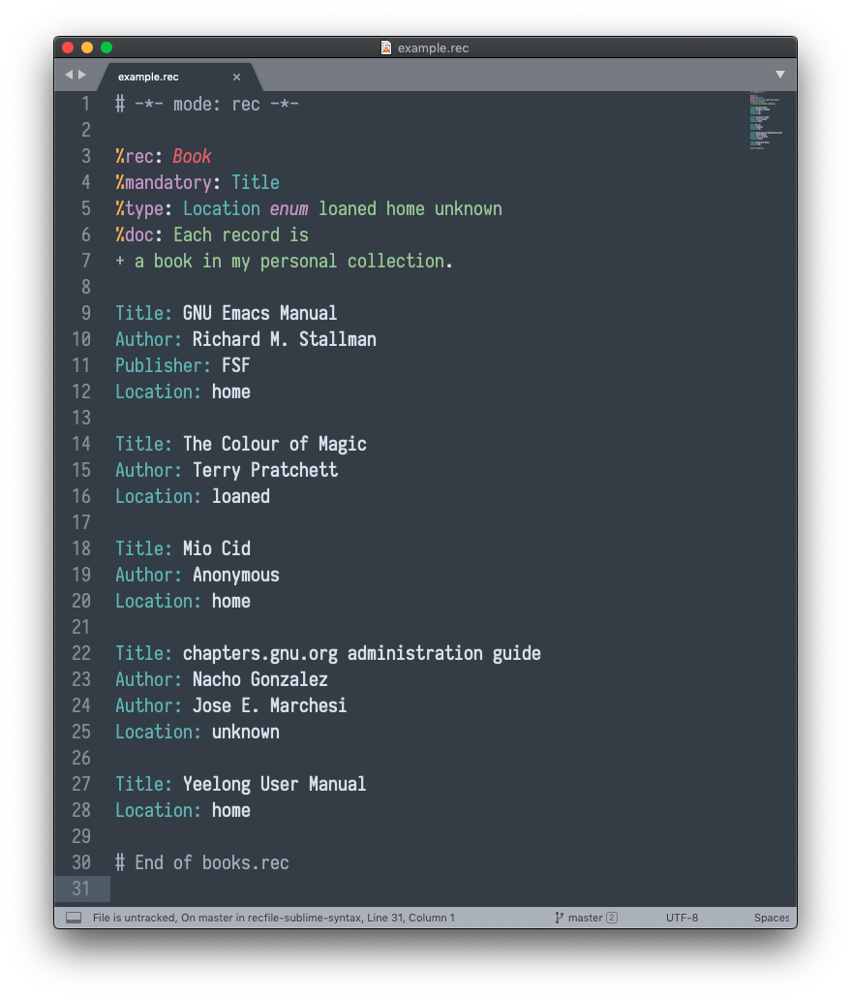
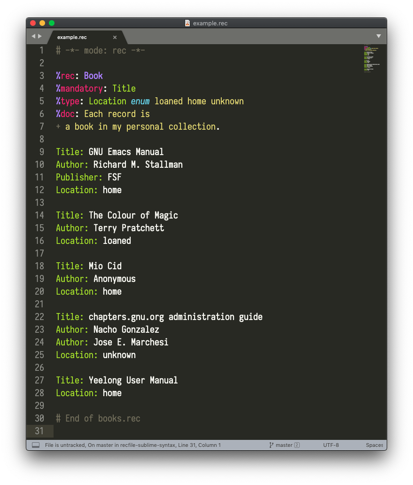

# GNU Recutils Syntax for Sublime Text 3
This syntax definition adds highlighting support for plain-text databases ("recfiles") used with GNU Recutils. For full details on the GNU Recutils project, see [here](https://www.gnu.org/software/recutils/).

## Supported Elements
This syntax supports the majority of the supported elements defined in [the official recfile specification](https://www.gnu.org/software/recutils/manual/The-Rec-Format.html#The-Rec-Format).

## Setup Instructions
To use this syntax with Sublime Text 3:
1. Install the `PackageDev` package via Package Control
2. Go to `Tools` -> `Packages` -> `Package Development` -> `New Syntax Definition...`
3. Paste in the contents of the syntax definition in the file `recfile.sublime-syntax` into your new syntax definition and save it.

## Samples
### Mariana Color Scheme

### Monokai Color Scheme

